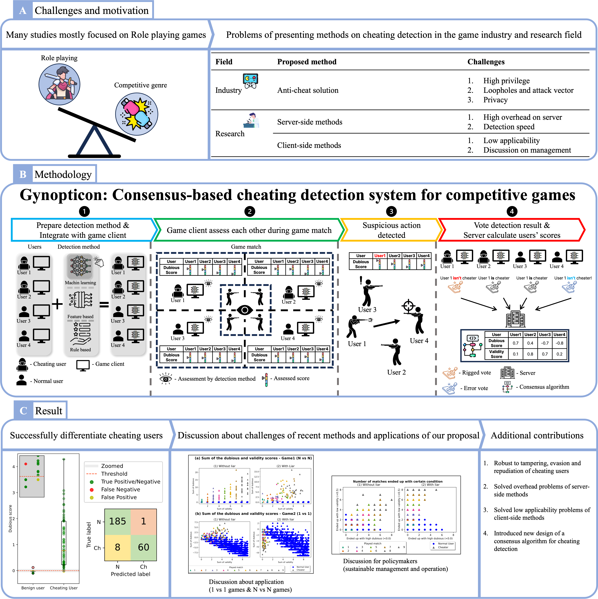

# Gynopticon


Gynopticon is a new type of anti-cheat system that leveraging power of the normal users' consensus and detecting the cheating users. 

In addition, Gynopticon can be applied to any kinds of online competitve games.

# File structure and package dependency

## Dependencies

Please use Python3.10, since our experiments and previous studies we inferred in our paper are using 3.10 version.

The requirements can be installed with following command

```
$ pip install -r requirements.txt
```

We strongly recommend to use virtual environment.

## File structure

Each directory and file in the repository are related with each section in the paper.

|**Name**|**Description**|**Related Sections**|
|--------|---------------|-----------------|
|/model/model.py |Simulation code|Section 2 (Gynopticon: a...)|
|/model/customized.py|Customized consensus algorithm for testing on FPS genre|Section 3 (Evaluation)|
|/eval/eval.py|Evaluation when without liar|Section 3.5 (Results)|
|/eval/lie.py|Evaluation when with liar|Section 3.5 (Results)|
|/plot.py|Generates figures in the paper| All | 

# Reproducing the results

## Download dataset
First, download the [dataset](https://zenodo.org/records/8058051), decompress it, and locate it in /data directory.

After decompression, the structure of directory should be organized as following.

```
data
├── exp_1
├── exp_2
├── exp_3
└── exp_4
```

## Evaluation

You can reproduce the results of experiemtns with following commands.

```
# Without liar
$ python3 eval/eval.py

# With liar
$ python3 eval/lie.py
```

If you want to conduct experiments on different condition, you have to delete files in /trained_models directory and change a seed number. For that you have to edit seed numbers in `/utils/__init__.py`, `/res/Botscreen/utils/util.py`. The files contain seed numbers for *Gynopticon (our project)*, *Botscreen (datasets and detection method)* each.

## Figures

If you want to generate figures for the results of experiments, you can simply reproduce it with following command.

```
$ python3 plot.py
```

# Abstract

Here's the summary of our paper.



# Citation
WIP