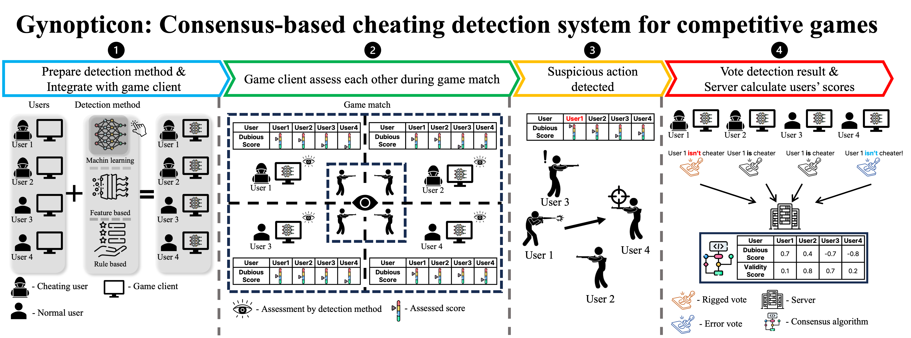

# Gynopticon

Gynopticon is a new type of anti-cheat system that leveraging power of the normal users' consensus and detecting the cheating users. 

In addition, Gynopticon can be applied to any kinds of online competitve games.

## File structure and package dependency
